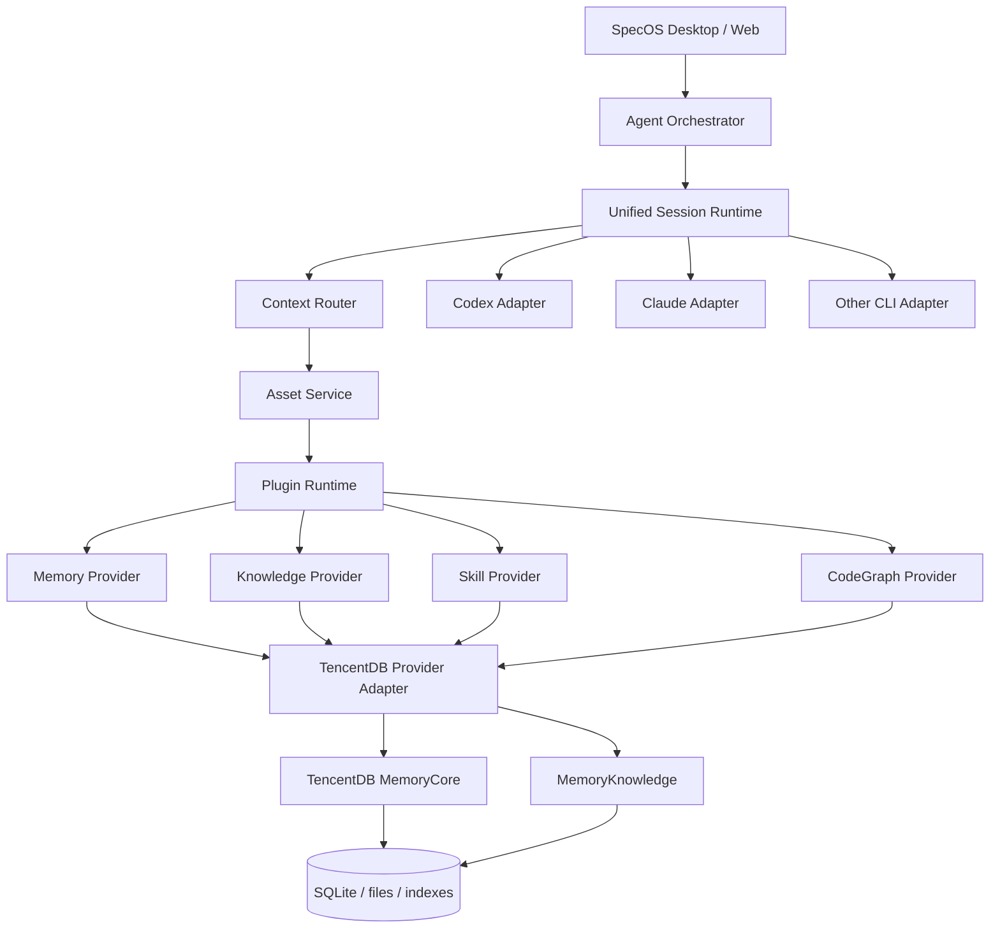

# ARCH — 系统架构与插件边界

## 1. Architecture



---

# 2. 进程模型

Desktop 模式：

```text
specos-desktop
├── Tauri Rust shell
├── Webview UI
├── Harness Runtime
├── CLI child processes
│   ├── codex
│   ├── claude
│   └── ...
├── MemoryCore sidecar
└── Knowledge/Indexer worker
```

推荐 MemoryCore/Knowledge 作为独立 sidecar，不嵌到 UI runtime。

---

# 3. Domain Layer

核心 domain 不出现 TencentDB 名称。

```ts
interface MemoryProvider {}
interface SkillProvider {}
interface KnowledgeProvider {}
interface CodeGraphProvider {}
interface AssetRegistry {}
```

TencentDB 只出现在：

```text
infrastructure/providers/tencentdb/**
```

---

# 4. Plugin Runtime

完整产品 Plugin contract：

```ts
interface SpecOSPlugin {
  manifest: PluginManifest;
  activate(ctx: PluginContext): Promise<void>;
  deactivate(): Promise<void>;
  health?(): Promise<PluginHealth>;
}
```

Manifest：

```yaml
id: memory.tencentdb
type:
  - memory-provider
  - skill-provider
  - knowledge-provider
  - codegraph-provider

version: 1.0.0

capabilities:
  chatMemory: true
  shortTermOffload: true
  skill: true
  wiki: true
  codegraph: true

requires:
  - lifecycle
  - secret-store
  - background-jobs
```

---

# 5. Lifecycle Bus

统一生命周期：

```text
workspace.opened
workspace.closed

project.opened
project.closed

session.created
session.resumed
session.closed

turn.submitted
turn.before
turn.started
turn.completed
turn.failed

tool.before
tool.after

task.created
task.updated
task.completed
task.failed

files.changed
git.commit.detected
```

Memory/Knowledge 插件只订阅事件。

---

# 6. Agent Runtime

所有 CLI 归一化为：

```ts
interface AgentRuntimeAdapter {
  capabilities(): AgentCapabilities;
  startSession(input: StartSessionInput): Promise<RuntimeSession>;
  sendTurn(input: AgentTurnInput): AsyncIterable<AgentEvent>;
  stopSession(sessionId: string): Promise<void>;
}
```

AgentEvent：

```ts
type AgentEvent =
  | TextDelta
  | ReasoningDelta
  | ToolCall
  | ToolResult
  | PlanUpdate
  | SubagentEvent
  | FileChange
  | FinalMessage
  | UsageEvent
  | ErrorEvent;
```

Memory 不理解 Claude/Codex 私有事件，只理解归一化后的 events。

---

# 7. Context Router

这是完整方案的核心新增层。

输入：

```ts
ContextRequest {
  userMessage
  projectId
  sessionId
  taskId?
  agentId
  modelProfile
  currentFiles?
  gitState?
}
```

输出：

```ts
ContextBundle {
  rules[]
  taskContext[]
  memories[]
  skills[]
  wiki[]
  codeGraph[]
  citations[]
  tokenUsage
  decisions[]
}
```

---

# 8. Context 优先级

默认：

```text
P0 System security/policy
P1 Explicit current user instructions
P2 Project hard rules
P3 Active task state
P4 Relevant code evidence
P5 Approved skills
P6 Project decisions / L1 facts
P7 Scenarios
P8 Persona
P9 Wiki background
```

注意 Prompt 物理位置与逻辑优先级可以不同，但必须明确告诉模型冲突规则。

---

# 9. Asset Service

统一资产接口：

```ts
type AssetType =
  | "memory"
  | "skill"
  | "wiki"
  | "codegraph"
  | "task-context";

interface AssetRef {
  id: string;
  type: AssetType;
  scope: AssetScope;
  providerId: string;
  version?: string;
}
```

上层 UI 不直接依赖 TencentDB metadata DTO。

---

# 10. Background Job System

完整产品必须有后台任务队列：

```text
memory.extract.l1
memory.aggregate.l2
memory.aggregate.l3

task.offload
task.canvas.update

skill.discover
skill.validate

wiki.sync
wiki.rebuild

codegraph.scan
codegraph.incremental

backup.create
maintenance.cleanup
```

状态：

```text
queued
running
retrying
completed
failed
cancelled
```

---

# 11. Local vs Remote

统一 connection profile：

```yaml
assetEngine:
  mode: local | remote

  local:
    autoStart: true

  remote:
    endpoint:
    authRef:
    tls:
```

UI 和上层 domain 无需改变。

---

# 12. Sidecar Supervisor

Rust/Tauri 负责：

- executable discovery
- version check
- port allocation
- process start
- stdout/stderr collection
- health polling
- restart policy
- crash loop protection
- graceful shutdown
- migration coordination

状态机：

```text
STOPPED
STARTING
HEALTHY
DEGRADED
RESTARTING
FAILED
MIGRATION_REQUIRED
VERSION_MISMATCH
```

---

# 13. Adapter SDK 与 MCP 的区别

### SDK/Gateway

给 SpecOS runtime 使用：

- capture
- recall
- CRUD
- pipeline
- metadata
- skill
- knowledge
- management

### MCP

给模型主动调用：

- memory.search
- conversation.search
- wiki.search
- code.search
- skill.search

不要让 MCP 承担 app lifecycle。

---

# 14. Storage ownership

SpecOS 保存：

```text
Project identity
Plugin config
Agent profiles
Loadouts
Provider binding
UI metadata overlays
Job state
Backup manifests
```

TencentDB 保存：

```text
Memory payloads
L0-L3
Skill assets
Knowledge metadata
Wiki/CodeGraph indexes/content according to upstream runtime
```

---

# 15. Data Directory

建议：

```text
<AppData>/specos/
  runtime/
  projects/
    <project-id>/
      project.json
      agents/
      loadouts/
      task-state/
  providers/
    tencentdb/
      runtime/
      data/
      config/
      logs/
      backups/
```

不要把运行数据库放到 git repository。

---

# 16. Failure Domain

每个 provider operation 必须：

```ts
Result<T, ProviderError>
```

错误：

```text
Unavailable
Timeout
Unauthorized
InvalidResponse
VersionMismatch
MigrationRequired
ScopeViolation
DataCorruption
RateLimited
ProviderInternal
```

Agent turn 对非关键 Asset 错误默认 fail-open。

---

# 17. Cross-process 幂等

Capture key：

```text
projectId + sessionId + messageId
```

Job key：

```text
type + assetId + revision
```

避免：

- Stop hook 重复触发
- app crash 重启后重复写入
- CLI hook + SpecOS event 双重 capture

---

# 18. 兼容外部 CLI hooks

如果一个 CLI 已经安装 TencentDB 官方 adapter：

SpecOS 必须检测并提示：

```text
External memory adapter detected.
Use:
( ) SpecOS managed
( ) External adapter
```

禁止两套自动 capture 同时运行。

---

# 19. Future Provider

Provider architecture 应允许：

```text
TencentDB
OpenViking
Mem0
Custom
Noop
```

但完整产品第一版只需要把 TencentDB 做到 production-ready。

---

# 20. Architecture Acceptance

- [ ] CLI adapter 不依赖 TencentDB
- [ ] UI 不依赖 TencentDB DTO
- [ ] Provider 可 mock
- [ ] sidecar 可独立重启
- [ ] memory failure 不杀 session
- [ ] plugin 可 disable
- [ ] context bundle 有完整 provenance
- [ ] all write operations idempotent
- [ ] local/remote mode 上层行为一致

---

## 上游参考与实现注意

本方案依据 2026-08-18 可见的 TencentCloud/TencentDB-Agent-Memory 项目设计整理，重点参考：

- `README.md` / `README_CN.md`
- Releases 1.x / 2.0.0-beta.1
- `MemoryCore/README.md` (`feat/server_team`)
- Codex / Claude Code / OpenCode adapter work

上游：
https://github.com/TencentCloud/TencentDB-Agent-Memory

实现时必须固定经过测试的 tag/commit，不应直接依赖持续变化的 branch HEAD。
