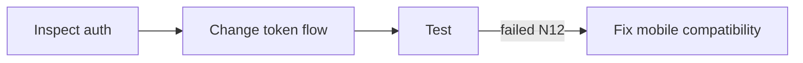

# MEMORY — 记忆模型、召回与上下文工程

# 1. 长期记忆模型

采用 TencentDB L0-L3：

## L0 Conversation

原始事实证据。

保存：

- user message
- assistant final
- selected tool summaries
- timestamps
- session/task refs

不默认注入。

---

## L1 Atom

一条可独立成立的事实/偏好/决定。

示例：

```text
Project uses pnpm.
Desktop runtime uses Tauri.
Do not refactor legacy auth until mobile migration completes.
```

建议 Overlay 元数据：

```ts
{
  confidence: 0..1,
  validity: "active" | "superseded" | "disputed" | "expired",
  scope,
  tags,
  sourceRefs[],
  supersedes[],
  conflictsWith[],
}
```

---

## L2 Scenario

聚合一组相关 Atom：

```text
Auth modernization constraints
Database migration strategy
Frontend component conventions
```

用途：

- 宏观主题
- 架构背景
- recurring workflows

---

## L3 Persona

长期稳定用户/项目画像：

```text
User prefers plan before broad refactors.
Project favors local-first architecture.
User strongly values plugin boundaries.
```

L3 不应保存瞬时事实。

---

# 2. Memory 分类

在 L1 之上增加业务分类，不改变上游层级：

```text
preference
decision
constraint
fact
lesson
incident
workflow
goal
relationship
environment
```

---

# 3. Scope

```ts
interface AssetScope {
  userId: string;
  workspaceId?: string;
  projectId?: string;
  teamId?: string;
  agentId?: string;
  taskId?: string;
}
```

规则：

- project fact 必须 project scoped
- personal preference 可以 user scoped
- agent-specific behavior 可以 agent scoped
- task temporary memory 不升级到 Persona，除非多次验证

---

# 4. Memory Promotion Policy

避免“一句话就变永久人格”。

## L0 → L1

满足：

- 明确陈述
- 有复用价值
- 非 transient
- 非 secret
- 非纯工具噪声

## L1 → L2

满足：

- 同主题有多个事实
- 时间/任务上存在相关性
- 能形成稳定场景

## L2 → L3

满足：

- 跨多个 session
- 长期稳定
- 高 confidence
- 不与更新信息冲突

---

# 5. Conflict

示例：

```text
old: use REST
new: use gRPC
```

处理：

```text
new atom active
old atom superseded
link supersedes
```

Recall 默认排除：

```text
superseded
expired
rejected
```

用户仍可在 Hub 查看历史。

---

# 6. Memory TTL

不是所有记忆永久保存。

建议：

```text
Persona: no TTL
architecture decision: no TTL / explicit supersede
preference: no TTL but decay confidence
temporary environment fact: 30d
incident context: 90d
task-specific detail: task lifetime + archive
```

---

# 7. Recall Router

不要每轮“所有资产一起向量搜索”。

先分类 query：

```text
user-preference
project-fact
architecture
code-impact
how-to
repeat-workflow
task-resume
historical-debug
documentation
```

然后选择 source。

示例：

```text
"为什么我们不用 Electron？"
→ Memory L1/L2 + Wiki ADR

"这个函数改了影响谁？"
→ CodeGraph first

"再按上次方式发版"
→ Skill + Memory scenario

"继续昨天的重构"
→ Task Canvas first
```

---

# 8. Recall Pipeline

```text
Query
  ↓
Intent classify
  ↓
Scope filter
  ↓
Candidate retrieval
  ├── Persona
  ├── Scenario
  ├── Atom
  ├── Skill
  ├── Wiki
  └── CodeGraph
  ↓
Recency / validity / authority filter
  ↓
Dedup
  ↓
Rerank
  ↓
Budget allocation
  ↓
Context bundle
```

---

# 9. Retrieval Strategy

TencentDB 支持：

```text
keyword / BM25
embedding
hybrid + RRF
```

默认：

```yaml
strategy: hybrid
```

如果 embedding 不可用：

```text
fallback = BM25
```

---

# 10. Budget Manager

总 context 不应被 memory 无限侵占。

建议模型级：

```yaml
contextBudget:
  maxAssetRatio: 0.15
  maxRecallLatencyMs: 1500

allocation:
  task: 0.25
  codeGraph: 0.20
  skills: 0.15
  memory: 0.20
  wiki: 0.20
```

按需求动态调整。

---

# 11. Memory Injection

```md
<specos_context source="memory">
Historical context. It may be outdated. Current explicit user
instructions and verified repository evidence take precedence.

[Decision|project|high]
Desktop shell is Tauri.
source: memory://atom/123

[Preference|user|medium]
Prefer implementation plan before large changes.
source: memory://atom/456
</specos_context>
```

禁止伪装成 system instruction。

---

# 12. Provenance

每个 injected item 都必须生成：

```ts
ContextEvidence {
  assetId
  assetType
  provider
  layer
  score
  sourceRefs
  tokenCount
  reason
}
```

Recall Inspector 使用。

---

# 13. Active Search

模型工具：

```text
memory_search(query, scope?, layers?)
conversation_search(query, timeRange?)
```

模型需要原始证据时：

```text
L3 → L2 → L1 → L0
```

而不是自动把所有 L0 注入。

---

# 14. Short-term Memory

## Raw Ref

工具大结果写入：

```text
task/<task-id>/refs/<node-id>.md
```

## JSONL

```json
{"node_id":"N12","summary":"Tests failed in auth integration","result_ref":"refs/N12.md"}
```

## Mermaid



上下文仅常驻 MMD + 当前节点摘要。

---

# 15. Offload Threshold

根据模型 context：

```text
< 50%: no offload
50-85%: mild
> 85%: aggressive
```

具体可跟随 TencentDB 参数。

---

# 16. Task Resume

Checkpoint：

```ts
TaskCheckpoint {
  taskId
  canvasRef
  currentNodeId
  completedNodeIds[]
  unresolvedIssues[]
  changedFiles[]
  nextActions[]
  createdAt
}
```

Resume 时先注入 checkpoint，不回放全部 transcript。

---

# 17. Capture Policy

捕获：

- user message
- assistant final
- explicit decisions
- finalized plan
- important failure/recovery summary

默认不捕获：

- streaming deltas
- reasoning chain
- heartbeat
- cron noise
- raw huge output
- secret-bearing payload
- binary

---

# 18. Secret Filter

pre-capture：

```text
redaction
classification
size limit
mime check
```

检测：

- API keys
- bearer tokens
- private keys
- passwords
- cookies
- database URLs
- cloud credentials

用户可配置项目 exclude patterns。

---

# 19. User Correction

Memory detail：

```text
[Mark incorrect]
[Supersede]
[Delete]
```

纠正推荐创建一个新的 authoritative atom，并将旧记录 superseded，而非直接修改上游 evidence。

---

# 20. Recall Quality Metrics

记录：

```text
hit rate
accepted context rate
user-hidden context rate
manual search after auto-recall rate
wrong-memory reports
superseded recall violations
latency
injected tokens
```

后续用于调 recall router。

---

# 21. Memory QA

P0：

- [ ] cross-session recall
- [ ] cross-CLI recall
- [ ] project isolation
- [ ] agent scope isolation
- [ ] task resume
- [ ] conflict suppression
- [ ] deleted memory never auto-recalled
- [ ] token budget enforced
- [ ] L0 evidence drill-down works
- [ ] gateway timeout fail-open

---

## 上游参考与实现注意

本方案依据 2026-08-18 可见的 TencentCloud/TencentDB-Agent-Memory 项目设计整理，重点参考：

- `README.md` / `README_CN.md`
- Releases 1.x / 2.0.0-beta.1
- `MemoryCore/README.md` (`feat/server_team`)
- Codex / Claude Code / OpenCode adapter work

上游：
https://github.com/TencentCloud/TencentDB-Agent-Memory

实现时必须固定经过测试的 tag/commit，不应直接依赖持续变化的 branch HEAD。
